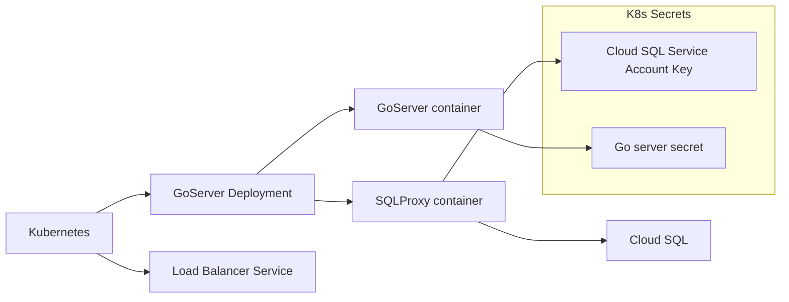
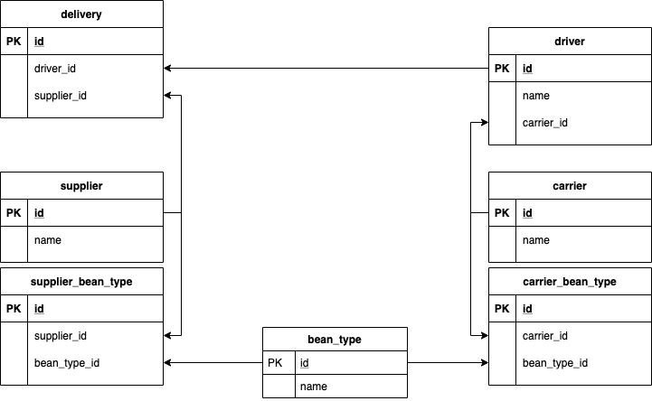

# Overview

Here is my solution to the [DevOps Engineering Challenge](https://gist.github.com/VortoEng/53a027df8665b2bcca160b8256393f4f)

The service is exposed (insecurely) :
http://35.239.75.83/

A list of items that should be completed are located in the [TODO.md](./TODO.md)

## General Architecture

I like to use [Mermaid Diagrams](https://mermaid-js.github.io/mermaid/#/) for documentation.  If you'd like this to render in Chrome, you can use the [Mermaid plugin](https://chrome.google.com/webstore/detail/github-%20-mermaid/goiiopgdnkogdbjmncgedmgpoajilohe?hl=en)

* Go related details are located [here](./go/README.md)
* Terraform related details are located [here](./terraform/README.md)

### SQL Details

ERD to understand interdependencies:

[Invalid Deliveries SQL File](./manually_deploy/cloudsql/invalid_deliveries.sql)

# Additional Information

In order to deliver a working solution, I needed to learn/review quite a few technologies just to set up the framework.

The first day or two, I spent creating "hello, world" versions within each technology.

* Initialize
    * Create GCP project (done)
    * Configure VS Code for Go (done)
    * Configure cloud_sql_proxy locally for Postgres (done)

* Go Server
    * Develop hello world (done)
    * Implement Cloud Build pipeline (done)
    * Build/push image (done)
* K8s
    * Manual
        * Create cluster (done)
        * Create deployment (done)
        * Create service (done)
    * Helm
        * Create helm chart (done)
        * Configure deployment (done)
        * Configure service (done)
        * Configure ingress (not needed?)
    * Terraform
        * Create cluster (done)
        * Deploy helm chart (done)

## Create solution

Finally, I got around to developing a solution.

* Create infrastructure
    * Terraform
        * K8s (done)
        * Helm (not complete... stuck on cloud_sql_proxy errors )
            * cloud_sql_proxy
            * go_server
        * Database (done)
            * Postgres
* Load data manually to Postgres (done)
* Explore data and create SQL query (done)
* Create go program
    * Getting started with go (done)
    * Query database (done)
    * Map objects for response (done)

### Gotcha!

**Service Account Issue**
Expected behavior:
* Connecting to cloud sql instance with service account succeeds
Actual behavior
* Service account not able to access cloud sql using cloudsql-proxy.

Solution:
"Create another service account after Enable the Cloud SQL API"
https://github.com/GoogleCloudPlatform/kubernetes-engine-samples/issues/68

-- Ended up just creating a separate service account for Cloud SQL connections

**Cloud SQL not creating**
Expected behavior:
* When running terraform destroy/apply, the Cloud SQL database should be re-created.
Actual behavior:
* Database does not get created and TF eventually times out

Solution:
"It seems we can not reuse the same instance name for up to a week after deleting an instance" 
https://github.com/terraform-providers/terraform-provider-google/issues/5101

-- Need to modify the instance name to have some unique name each time it is re-run

