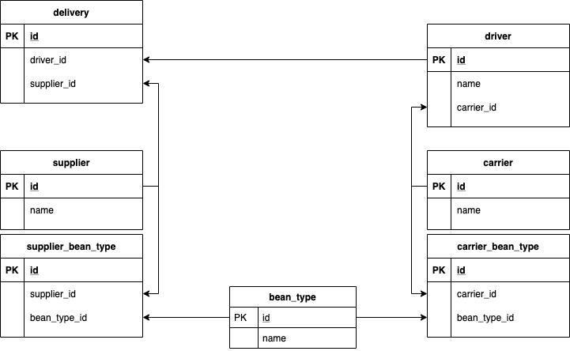

# Overview

I first deployed all resources manually, then added them to Terraform.  This helps me understand the deployment without adding the Terraform layers of abstraction, which always seems to cause issues when I don't quite understand what it is doing.

* Create sql instance
    * Details in deploy.sh
* Add `postgres` user
* Create `public` schema
* Import sql dump file
* Create connection using cloud_sql_proxy
* Configure pgadmin4 (docker)
    * Caveat: Since I'm trying to connect to localhost, the connection host is `host.docker.internal`
* Explore data and identify invalid deliveries
    * invalid_deliveries.sql
    * Create ERD diagram 



# pgadmin4

pgadmin4 is the Postgres client that I used for the SQL development
* Pull and run

```
docker pull dpage/pgadmin4:latest
docker run -p 80:80 \
    -e 'PGADMIN_DEFAULT_EMAIL=admin@gmail.com' \
    -e 'PGADMIN_DEFAULT_PASSWORD=admin' \
    -d dpage/pgadmin4
```

# Cloud SQL Proxy

Open connection to Cloud SQL instance
```
./cloud_sql_proxy -instances=sandbox-mtm:us-central1:vorto4-f75d323e=tcp:5432
```

Run using docker
```
docker run \
  -v /Users/mmiller18/Documents/Personal/GitHub/vorto-devops/manually_deploy/k8_deploy:/config \
  -p 127.0.0.1:5432:5432 \
  gcr.io/cloudsql-docker/gce-proxy:1.16 /cloud_sql_proxy \
  -instances=sandbox-mtm:us-central1:vorto4-f75d323e=tcp:0.0.0.0:5432 -credential_file=/config/json.secret
```

## Manual connection test

```
psql "dbname=public host=localhost user=postgres password=postgres port=5432 sslmode=disable"
```