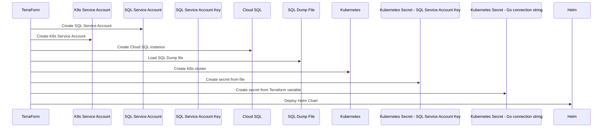

# Overview

Terraform is great, except when it's not.  So, I started out trying to use providers, and modules available through the community.  Sometimes this worked, and other times it did not, so I actually spent a lot of time debugging the layers of abstraction added in when using these products.  Eventually, I got everything working and tried to get it to a simple implementation.  Simple is always best, right?

## Deployment Overview

Everything is deployed/managed by Terraform.  You should be able to re-deploy fairly easily, given you have the correct permissions on the GCP project and APIs enabled (Kubernetes and Cloud SQL).

Create a `terraform.tfvars` file, then run: 

```sh
terraform init
terraform apply
```

## Sequence Diagram

